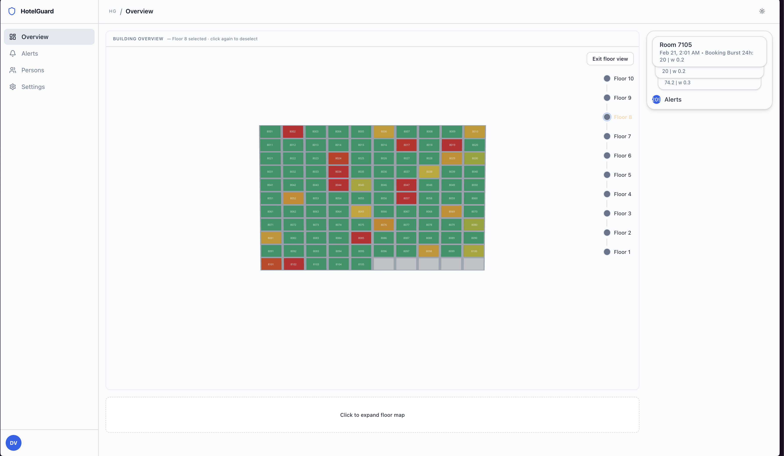
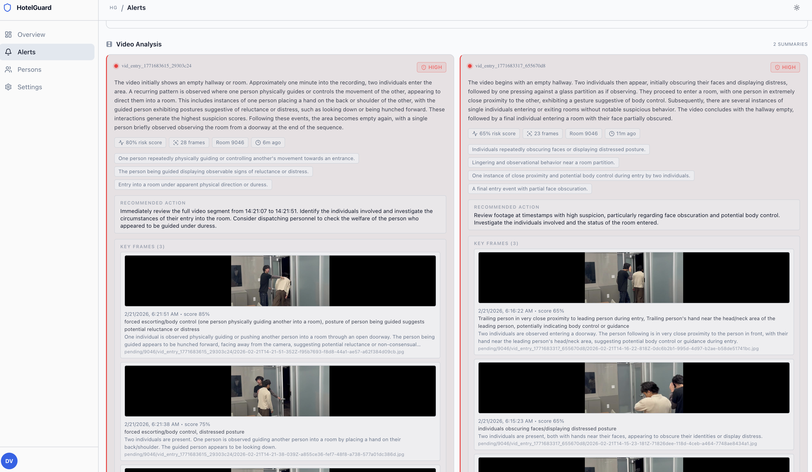
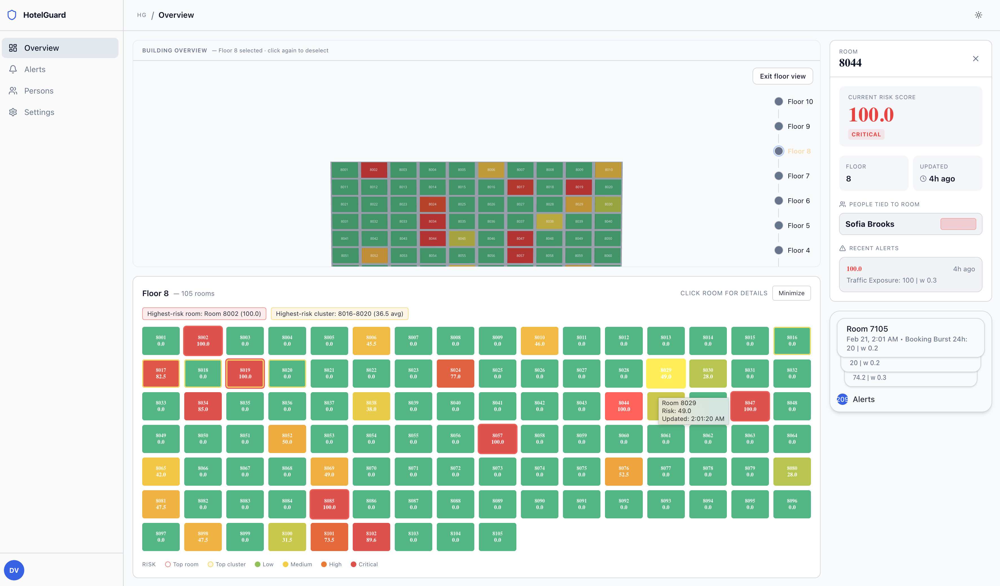

# HotelGuard (SafeStay AI)
*website url:* https://hotelguard.vercel.app

HotelGuard is a hotel risk-monitoring dashboard that combines:
- Operational webhook events (PMS + housekeeping)
- CV frame ingestion + Gemini-based analysis
- Room/person risk scoring surfaced in a Next.js dashboard

## Screenshots

### Overview (Collapsed Floor View)


### Alerts (Video Analysis)


### Overview (Expanded Floor + Room Detail)


## Repo Layout

- `frontend/` - Next.js dashboard and API routes
- `cv/` - Python CV uploader/utilities
- `supabase/functions/` - Supabase Edge Functions (`score-risk`, `ingest-cv`)
- `people_counter.py` - standalone YOLO tracking/counting script

## Prerequisites

- Node.js 20+
- `pnpm`
- Python 3.10+
- A Supabase project (URL, anon key, service role key)
- Gemini API key (for CV analysis routes)

## 1) Run the Frontend

```bash
cd frontend
pnpm install
```

Create `frontend/.env.local`:

```bash
NEXT_PUBLIC_SUPABASE_URL=https://<your-project>.supabase.co
NEXT_PUBLIC_SUPABASE_ANON_KEY=<your-anon-key>
SUPABASE_SERVICE_ROLE_KEY=<your-service-role-key>

CV_API_KEY=<shared-secret-for-cv-uploader>
GEMINI_API_KEY=<your-gemini-key>

# Optional
GEMINI_MODEL=gemini-2.5-flash
CV_HIGH_RISK_THRESHOLD=10
CV_EVIDENCE_ENABLED=true
CV_EVIDENCE_SUSPICION_THRESHOLD=0.15
CV_EVIDENCE_MAX_FRAMES_PER_REQUEST=5
HOTELGUARD_ADMIN_TOKEN=<token-for-/api/ingest/canonical>
HOTELGUARD_ADMIN_EMAILS=admin@example.com
NEXT_PUBLIC_SITE_URL=http://localhost:3000
```

Start dev server:

```bash
pnpm dev
```

Open `http://localhost:3000`.

## 2) Apply Database Migrations

Migrations are in `frontend/supabase/migrations/`.
Apply them to your Supabase project before using ingestion/risk features.

## 3) (Optional) Run Webhook Test Flows

From `frontend/`:

```bash
bash scripts/test-webhooks.sh
bash scripts/test-ingestion.sh
```

Optional overrides:
- `BASE_URL` (default `http://localhost:3000`)
- `PROPERTY_ID`
- `PMS_SECRET`
- `HK_SECRET`
- `HOTELGUARD_ADMIN_TOKEN`

## 4) (Optional) Run Python CV Uploader

```bash
python -m venv .venv
source .venv/bin/activate
pip install -r cv/requirements.txt
```

Set env vars (shell or `.env`):

```bash
NEXT_API_BASE_URL=http://localhost:3000
CV_API_KEY=<same as frontend/.env.local>
ROOM_ID=8044
CAMERA_SOURCE=0
# or CAMERA_SOURCE=/absolute/path/to/video.mp4
```

Run uploader:

```bash
python cv/uploader.py
```

## 5) (Optional) Reset CV Data

TypeScript reset script:

```bash
cd frontend
pnpm dlx tsx scripts/reset-cv-data.tsx
```

Python reset script:

```bash
python cv/reset_cv_data.py
```

## Standalone People Counter (Optional)

Example:

```bash
python people_counter.py --video input.mp4 --show --room-id 8044 --cv-api-key <CV_API_KEY>
```

## Notes

- `score-risk` is a Supabase Edge Function under `supabase/functions/score-risk`.
- The frontend CV ingest route attempts to invoke `score-risk`; deploy/configure it in Supabase for full end-to-end scoring.
