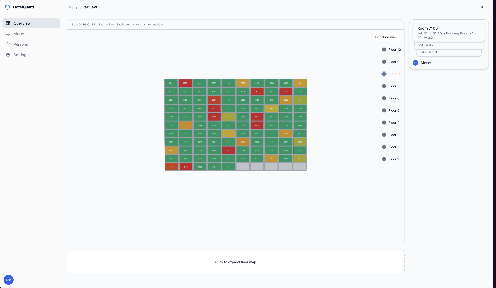
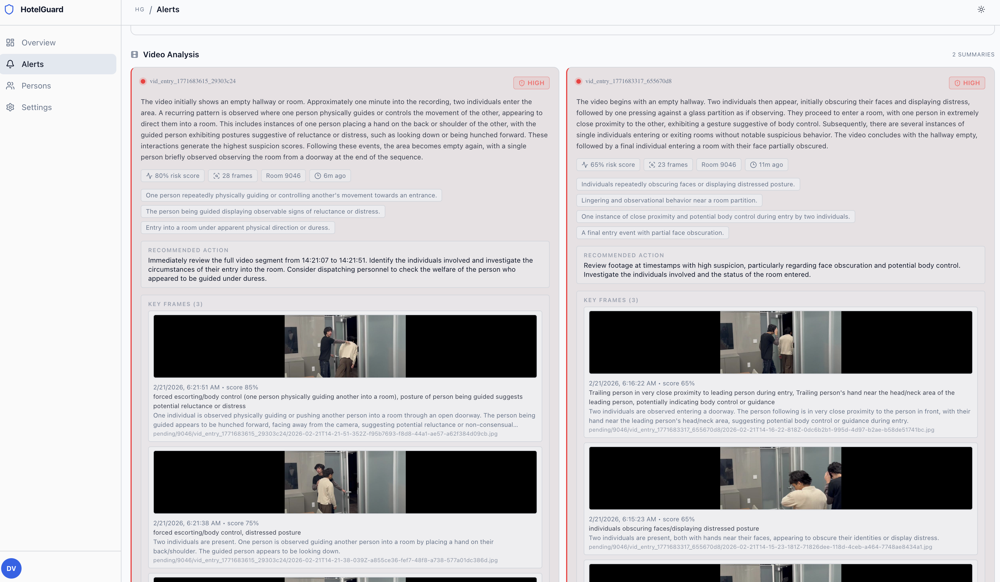
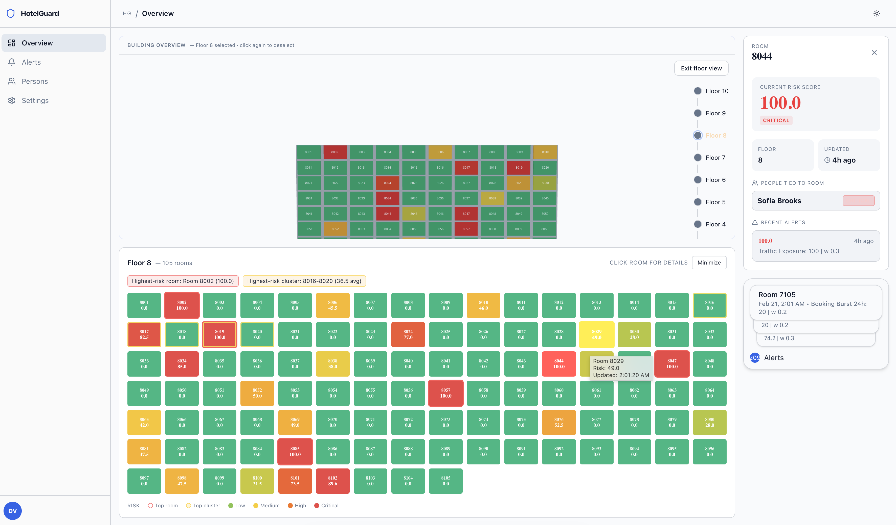

# HotelGuard (SafeStay AI)
*website url:* https://hotelguard.vercel.app

HotelGuard is a hotel risk-monitoring dashboard that combines:
- Operational webhook events (PMS + housekeeping)
- CV frame ingestion + Gemini-based analysis
- Room/person risk scoring surfaced in a Next.js dashboard

## Screenshots

### Overview (Collapsed Floor View)


### Alerts (Video Analysis)


### Overview (Expanded Floor + Room Detail)


## Repo Layout

- `frontend/` - Next.js dashboard and API routes
- `cv/` - Python CV uploader/utilities
- `supabase/functions/` - Supabase Edge Functions (`score-risk`, `ingest-cv`)
- `people_counter.py` - standalone YOLO tracking/counting script

## Prerequisites

- Node.js 20+
- `pnpm`
- Python 3.10+
- A Supabase project (URL, anon key, service role key)
- Gemini API key (for CV analysis routes)

## 1) Run the Frontend

# SafeStay AI

SafeStay AI is a hotel risk-monitoring prototype that combines:
- Operational event ingestion (webhooks + canonical events)
- Computer-vision frame ingestion
- AI-assisted frame/video analysis
- Room-level risk scoring and alerts in a real-time dashboard

It is designed to work with metadata, not identity. The CV flow analyzes frame content and writes structured risk data to Supabase.

## Repository Structure

- `frontend/`: Next.js app (dashboard + API routes + Supabase integration)
- `cv/`: Python uploader and utilities for CV ingestion
- `people_counter.py`: YOLO-based people tracking + uploader trigger flow
- `supabase/functions/`: Edge functions (`score-risk`, `ingest-cv`, `seed-demo`)
- `frontend/supabase/migrations/`: SQL migrations for schema setup

## High-Level Flow

1. Python sends frame batches to `POST /api/ingest/cv-images`.
2. Next.js route validates API key and runs Gemini frame analysis.
3. Results are stored in Supabase tables (`cv_frame_analysis`, `cv_events`, `cv_video_summaries`, `cv_risk_evidence`).
4. `score-risk` is invoked to refresh room/person risk views.
5. Dashboard reads risk/alerts and updates via Supabase Realtime.

## Prerequisites

- Node.js 20+
- `pnpm`
- Python 3.10+
- `pip`
- Supabase project with service key
- Gemini API key (for CV analysis route)

## 1) Frontend Setup

From repo root:

```bash
cd frontend
pnpm install
```

Create `frontend/.env.local`:

```bash
NEXT_PUBLIC_SUPABASE_URL=https://<your-project>.supabase.co
NEXT_PUBLIC_SUPABASE_ANON_KEY=<your-anon-key>
SUPABASE_SERVICE_ROLE_KEY=<your-service-role-key>

CV_API_KEY=<shared-secret-for-cv-uploader>
GEMINI_API_KEY=<your-gemini-key>

# Optional
GEMINI_MODEL=gemini-2.5-flash
CV_HIGH_RISK_THRESHOLD=10
CV_EVIDENCE_ENABLED=true
CV_EVIDENCE_SUSPICION_THRESHOLD=0.15
CV_EVIDENCE_MAX_FRAMES_PER_REQUEST=5
HOTELGUARD_ADMIN_TOKEN=<token-for-/api/ingest/canonical>
HOTELGUARD_ADMIN_EMAILS=admin@example.com
NEXT_PUBLIC_SITE_URL=http://localhost:3000
```

Start dev server:

```bash
pnpm dev
```

Open `http://localhost:3000`.

## 2) Apply Database Migrations

Migrations are in `frontend/supabase/migrations/`.
Apply them to your Supabase project before using ingestion/risk features.

## 3) (Optional) Run Webhook Test Flows

From `frontend/`:

```bash
bash scripts/test-webhooks.sh
bash scripts/test-ingestion.sh
```

Optional overrides:
- `BASE_URL` (default `http://localhost:3000`)
- `PROPERTY_ID`
- `PMS_SECRET`
- `HK_SECRET`
- `HOTELGUARD_ADMIN_TOKEN`

## 4) (Optional) Run Python CV Uploader

```bash
python -m venv .venv
source .venv/bin/activate
pip install -r cv/requirements.txt
```

Set env vars (shell or `.env`):

```bash
NEXT_API_BASE_URL=http://localhost:3000
CV_API_KEY=<same as frontend/.env.local>
ROOM_ID=8044
CAMERA_SOURCE=0
# or CAMERA_SOURCE=/absolute/path/to/video.mp4
```

Run uploader:

```bash
python cv/uploader.py
```

## 5) (Optional) Reset CV Data

TypeScript reset script:

```bash
cd frontend
pnpm dlx tsx scripts/reset-cv-data.tsx
```

Python reset script:

```bash
python cv/reset_cv_data.py
```

## Standalone People Counter (Optional)

Example:

```bash
python people_counter.py --video input.mp4 --show --room-id 8044 --cv-api-key <CV_API_KEY>
```

## Notes

- `score-risk` is a Supabase Edge Function under `supabase/functions/score-risk`.
- The frontend CV ingest route attempts to invoke `score-risk`; deploy/configure it in Supabase for full end-to-end scoring.

NEXT_PUBLIC_SUPABASE_URL=...
NEXT_PUBLIC_SUPABASE_ANON_KEY=...
NEXT_PUBLIC_SITE_URL=http://localhost:3000

# Server-side key (service role / secret)
SUPABASE_SECRET_KEY=...

# API auth between Python uploader and Next.js routes
CV_API_KEY=...

# Gemini
GEMINI_API_KEY=...
GEMINI_MODEL=gemini-2.5-flash

# Optional tuning
CV_HIGH_RISK_THRESHOLD=10
CV_EVIDENCE_ENABLED=true
CV_EVIDENCE_MAX_FRAMES_PER_REQUEST=24
CV_EVIDENCE_SUSPICION_THRESHOLD=0.5
```

Start frontend:

```bash
pnpm dev
```

App runs at `http://localhost:3000`.

## 2) Database Schema Setup

Apply SQL migrations from `frontend/supabase/migrations` to your Supabase project in timestamp order.

You can do this with either:
- Supabase CLI (`supabase db push`) after linking the project
- Supabase SQL Editor (run migration files manually in order)

Key CV tables used by uploader flow:
- `cv_events`
- `cv_frame_analysis`
- `cv_video_summaries`
- `cv_risk_evidence`
- `room_risk`

## 3) Python CV Setup

From repo root:

```bash
python3 -m venv .venv
source .venv/bin/activate
pip install -r cv/requirements.txt
```

Create/update `cv/.env`:

```bash
NEXT_API_BASE_URL=http://localhost:3000
CV_API_KEY=... # must match frontend/.env.local

CAMERA_SOURCE=0
ROOM_ID=0304
CAMERA_ID=hallway_cam_3

FRAME_SAMPLE_SECONDS=1
BATCH_SIZE=1
FLUSH_SECONDS=1
REQUEST_TIMEOUT_SECONDS=120

POST_RETRIES=2
RETRY_BACKOFF_SECONDS=1.5
```

## 4) Run Ingestion (Fastest Path)

From repo root:

```bash
python3 cv/uploader.py
```

This captures frames from `CAMERA_SOURCE` and sends them to:
- `POST /api/ingest/cv-images`
- `POST /api/ingest/cv-images/finalize` (at end of run)

## 5) Run People Tracking + Triggered Uploads

`people_counter.py` can monitor a video, compute in/out movement, check room risk, and trigger uploader clips.

Example:

```bash
python3 people_counter.py \
  --video ./path/to/video.mp4 \
  --room-id 0304 \
  --next-api-base-url http://localhost:3000 \
  --cv-api-key "$CV_API_KEY" \
  --show
```

Useful flags:
- `--count-mode zone` (default) or `--count-mode line`
- `--max-upload-triggers 1`
- `--upload-duration-seconds 10`
- `--uploader-script cv/uploader.py`

## 6) Reset CV Data (Start Fresh)

From `frontend/`:

```bash
pnpm cv:reset
```

This clears:
- `cv_risk_evidence`
- `cv_frame_analysis`
- `cv_video_summaries`
- `cv_events`

## 7) Run Integration Checks

From `frontend/`:

```bash
bash scripts/test-ingestion.sh
```

This validates webhook ingestion, dedupe behavior, and canonical ingest auth.

## Notes on `cv/main.py`

`cv/main.py` is currently a scaffold/TODO and is not the primary execution path. For working ingestion flows, use:
- `cv/uploader.py`
- `people_counter.py`

## Troubleshooting

- `401 Unauthorized` from CV routes:
  - Ensure `CV_API_KEY` in `cv/.env` exactly matches `frontend/.env.local`.
- Supabase auth/config errors:
  - Ensure `NEXT_PUBLIC_SUPABASE_URL` and `SUPABASE_SECRET_KEY` are set.
- Gemini failures:
  - Ensure `GEMINI_API_KEY` is valid.
- No data in dashboard:
  - Confirm migrations were applied and uploader requests are returning `200`.

## Security

- Do not commit real secrets to git.
- Use separate keys for local/dev/prod.
- Rotate exposed keys immediately if they were ever committed.
